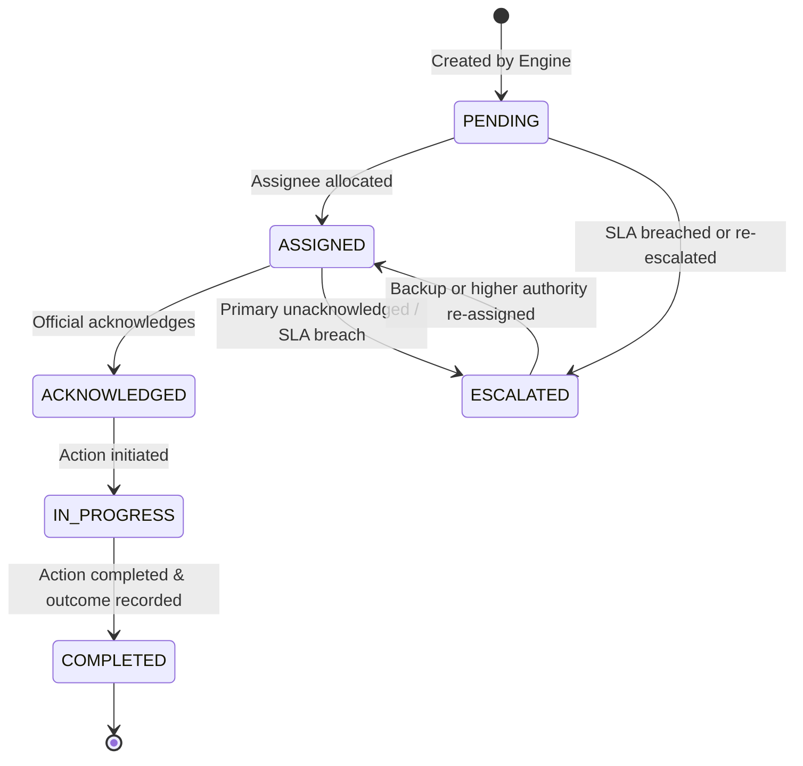

# AAROH — Intervention, Routing, Outcomes & Analytics Contract
**Author:** Preet (Operations & Analytics Owner)  
**Status:** DAY 1 ARCHITECTURE FREEZE  
**Scope:** Operational workflow following ML Prediction

---

## 1. System Mission & Operational Boundary

AAROH does not stop at prediction. Once the AI/ML subsystem produces distress states and escalation risk, this subsystem determines:
> **"What should happen next, who should handle it, how urgently, what was the outcome, and how is it reflected in aggregate analytics?"**

### Critical Ethical & Architectural Boundaries
1. **Human-in-the-Loop:** AAROH recommends and prioritizes. It **never** autonomously decides medical treatment, psychiatric medication, legal actions, witness protection, or relocation.
2. **Separation of Concerns:** The intervention engine does **not** calculate ML risk or distress scores. It consumes the validated prediction contract from Adwait (ML lead).
3. **Consent Authority:** If `monitoring_consent` is `False`, automated interventions are strictly blocked (`NO_AUTOMATED_INTERVENTION`).
4. **No Fake Integrations:** For demonstration and testing, synthetic personnel and mock routing are clearly designated as simulated.

---

## 2. Upstream Contract: Consuming Adwait's ML Output

The intervention engine consumes the validated output from `backend.ml.contract.MlInferenceResult`:

```json
{
  "case_id": "AAROH-001",
  "prediction_date": "2026-09-05",
  "status": "SUCCESS",
  "distress": {
    "score": 0.72,
    "trajectory": "RAPIDLY_WORSENING",
    "confidence": 0.88,
    "baseline_deviation": 0.35
  },
  "prediction": {
    "escalation_probability": 0.82,
    "target_horizon_days": 7,
    "confidence": 0.88,
    "risk_level": "HIGH"
  },
  "explanation": {
    "factors": [
      "Significant increase in fear signals",
      "Acute sleep disruption reported",
      "Sharp baseline distress deviation (+0.35)"
    ],
    "trend": "RAPIDLY_WORSENING",
    "baseline_deviation": 0.35
  },
  "model": {
    "model_name": "aaroh-escalation",
    "model_version": "aaroh-escalation-v1"
  }
}
```

### Handling Abstention & Low Confidence
If `status` is `LOW_CONFIDENCE`, `ABSTAINED`, or `INSUFFICIENT_DATA`:
- The system must **never** assume low risk.
- It triggers a special recommendation: `PRIORITY_HUMAN_REVIEW` with priority `HIGH` and explicit reasoning: `"Prediction uncertainty: human clinical/caseworker review required."`

---

## 3. Risk → Intervention Decision Matrix

| Situation / Trigger | Risk Level | Trajectory | Escalation Prob | Recommended Intervention Type | Priority | SLA Window |
| :--- | :--- | :--- | :--- | :--- | :--- | :--- |
| **No Consent** | Any | Any | Any | `NO_AUTOMATED_INTERVENTION` | `NONE` | None |
| **Uncertainty / Abstain** | Any | Any | `LOW_CONFIDENCE` / `ABSTAINED` | `PRIORITY_HUMAN_REVIEW` | `HIGH` | 24 Hours |
| **Critical Escalation** | `HIGH` | `RAPIDLY_WORSENING` | $\ge 0.75$ | `PRIORITY_HUMAN_REVIEW` | `URGENT` | 4 Hours |
| **High Escalation** | `HIGH` | Any | $\ge 0.75$ | `PRIORITY_HUMAN_REVIEW` | `URGENT` | 4 Hours |
| **Moderate Deterioration** | `MODERATE` | `WORSENING` / `RAPIDLY_WORSENING` | $\ge 0.40$ | `HUMAN_FOLLOW_UP` | `HIGH` | 24 Hours |
| **Moderate Concern** | `MODERATE` | `STABLE` | $\ge 0.40$ | `HUMAN_FOLLOW_UP` | `HIGH` | 24 Hours |
| **Positive Progress** | Any | `IMPROVING` / `RAPIDLY_IMPROVING` | $< 0.40$ | `CONTINUE_MONITORING` | `LOW` | 120 Hours |
| **Baseline Stability** | `LOW` | `STABLE` | $< 0.40$ | `ROUTINE_MONITORING` | `ROUTINE` | 72 Hours |

---

## 4. Intervention Support Categories (Problem Statement Specific)

When human caseworkers/officials review a case, the intervention engine recommends one or more structured intervention service domains:
1. `COUNSELLING_PSYCHOLOGICAL_SUPPORT`
2. `MEDICAL_TREATMENT_REFERRAL`
3. `WITNESS_PROTECTION_SUPPORT`
4. `RELOCATION_SAFETY_SUPPORT`
5. `FINANCIAL_COMPENSATION_ASSISTANCE`
6. `LEGAL_AID`
7. `REHABILITATION_SUPPORT`
8. `CONTINUED_MONITORING`

---

## 5. Intervention Status Lifecycle & State Machine



### State Transition Validation Rules:
- `PENDING` $\to$ `ASSIGNED`, `ESCALATED`, `CANCELLED`
- `ASSIGNED` $\to$ `ACKNOWLEDGED`, `ESCALATED`, `PENDING` (reassign)
- `ACKNOWLEDGED` $\to$ `IN_PROGRESS`, `ESCALATED`
- `IN_PROGRESS` $\to$ `COMPLETED`, `ESCALATED`
- `COMPLETED` is terminal. Transition from `COMPLETED` $\to$ `PENDING` is strictly forbidden.

---

## 6. Assignment & Routing Model

Routing evaluates:
$$\text{Assignment} = f(\text{Case District}, \text{Required Role}, \text{Priority}, \text{Assignee Availability/Capacity})$$

### Authorized Roles:
- `COUNSELLOR` (psychological check-in, distress de-escalation)
- `CASE_OFFICER` (rehabilitation, welfare, compensation support)
- `DESIGNATED_OFFICER` (witness security, immediate protection escort)
- `DISTRICT_AUTHORITY` (oversight, overdue escalation handling)

### Primary & Backup Routing:
1. **Primary Assignment:** Matches the district and lowest current caseload among authorized officials of the target role.
2. **Fallback / Backup Routing:** If an `URGENT` intervention is unacknowledged within 50% of the SLA window, a secondary notification is dispatched to the `backup_assignee` or supervisory role.

---

## 7. Service Level Agreements (SLA) & Overdue Detection

| Priority | SLA Time Window | Due Soon Threshold (80% Elapsed) | Escalation Threshold (Breached) |
| :--- | :--- | :--- | :--- |
| `URGENT` | 4 hours | 3 hours 12 minutes | > 4 hours |
| `HIGH` | 24 hours | 19 hours 12 minutes | > 24 hours |
| `ROUTINE` | 72 hours | 57 hours 36 minutes | > 72 hours |
| `LOW` | 120 hours | 96 hours | > 120 hours |

---

## 8. Outcome Recording & Closed Feedback Loop

When an intervention moves to `COMPLETED`, a structured `Outcome` record must be created.

### Controlled Outcome Vocabulary:
- `CONTACTED`: Victim was reached successfully.
- `COUNSELLING_PROVIDED`: Psychological first aid / counselling session conducted.
- `FOLLOW_UP_REQUIRED`: Initial contact established; further ongoing follow-up scheduled.
- `REFERRED`: Handed off to external medical/legal/welfare specialist.
- `UNABLE_TO_CONTACT`: Multiple contact attempts failed safely.
- `DECLINED`: Person exercised right to decline intervention.
- `RESOLVED`: Immediate safety or distress situation resolved.
- `OTHER`: Exceptional circumstances documented.

### Closing the Loop:
The intervention and outcome are linked to the next subsequent interaction:
$$\text{Intervention } (t_0) \longrightarrow \text{Outcome } (t_1) \longrightarrow \text{Next Interaction Distress } (t_2)$$
*Important:* Observed improvements are documented as **temporal correlation**, never claiming absolute causal proof without controlled clinical trials.

---

## 9. Analytics Requirements & Privacy Rules

### Aggregation Tiers:
1. **Case Level:** Longitudinal distress curve, escalation history, active interventions, response latencies.
2. **District Level:** Active case counts, distribution by risk tier, SLA compliance percentage, average resolution hours.
3. **State Level:** Multi-district comparative metrics, regional hotspots, resource allocation needs.
4. **National Level:** Macro trends, seasonal patterns, overall atrocity rehabilitation performance.

### Privacy Safeguards:
- **No Raw Narratives:** Aggregate APIs and dashboards return strictly counts, percentages, and statistical metrics.
- **K-Anonymity Guard:** Cells with counts $< 3$ in fine-grained filters are masked as `<3` to prevent victim re-identification in low-volume districts.
